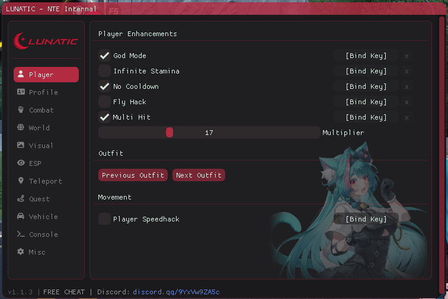

# LUNATIC - Neverness To Everness Internal

**Internal cheat for Neverness To Everness (NTE).**

Supports DirectX 11 and DirectX 12.

---

## Features

### Player

- God Mode
- Infinite Stamina
- No Cooldown
- Fly Hack
- Multi Hit with adjustable multiplier
- Player Speedhack with adjustable multiplier
- Outfit switcher

### Profile

- Nickname changer
- UID changer
- Restore original profile

### Combat

- Kill Aura with adjustable range
- Mob Vacuum with adjustable range
- Dumb Enemies

### World

- Auto Skip Video Cutscene
- Auto Skip Dialogue
- Global Speedhack with adjustable multiplier

### Visual

- No Camera Fade
- FPS Unlocker
- FPS preset selector
- Smoothing Fix

### ESP

- Master ESP toggle
- Monster ESP
- Draw Box
- Oracle Stone ESP
- Photo View ESP
- Treasure Box ESP
- Spacetime Projector ESP
- ESP range adjustment

### Teleport

- Show current coordinates
- Save named locations
- Teleport to saved locations
- Delete saved locations

### Vehicle

- Vehicle God Mode
- Vehicle Fly Mode
- Vehicle Speed Hack with adjustable multiplier
- N2O / Boost with **CTRL + W**

### Misc

- Save Config
- Show or hide overlay watermark
- Per-feature hotkeys from the menu

> Some features are unstable, especially Kill Aura, story skip automation, and Vehicle Fly Mode.

---

## Screenshot

---

## How to Use

### Windows

1. Download `LUNATIC.exe` from the [Releases](https://github.com/n0buholic/LUNATIC/releases) page.
2. Run `LUNATIC.exe` as administrator.
3. Select DirectX 11 or DirectX 12 in the loader.
4. Click **LAUNCH GAME** and wait for automatic injection.
5. In game, press **INSERT** to open or close the menu.

### Linux (Lutris / Wine)

1. Download `LUNATIC.exe` from the latest release.
2. Run `LUNATIC.exe` inside the same Wine prefix used by NTE.
3. Select DirectX 11 or DirectX 12.
4. Click **LAUNCH GAME** and wait for automatic injection.
5. In game, press **INSERT** to open or close the menu.

### Linux (Steam / Proton)

1. Download `LUNATIC.exe` from the latest release.
2. Add `LUNATIC.exe` as a non-Steam game, or run it with the same Proton prefix used by NTE.
3. Select DirectX 11 or DirectX 12.
4. Click **LAUNCH GAME** and wait for automatic injection.
5. In game, press **INSERT** to open or close the menu.

---

## Loader Notes

- The loader detects the NTE install folder automatically when possible.
- If detection fails, select the folder that contains `NTEGlobalLauncher.exe`.
- The loader starts `NTEGlobalGame.exe`, installs the launcher agent, waits for `HTGame.exe`, and injects automatically.
- The loader may retry the bootstrap if the game exits during injection.

---

## Troubleshooting

### OpenProcess failed

Run `LUNATIC.exe` as administrator. This is usually caused by a privilege mismatch between the loader and the target process.

### Game folder not found

Select the NTE install folder manually. The correct folder contains `NTEGlobalLauncher.exe`.

### Injection timeout or retry limit reached

Close NTE and the loader. Open Task Manager and end any remaining NTE-related processes, especially:

- `HTGame.exe`
- `NTEGlobalGame.exe`
- `NTEGlobalBrowser.exe`
- `NTEGlobalWebBooster.exe`
- `NTEGlobalUpdate.exe`

Then run `LUNATIC.exe` again as administrator.

---

## Community

